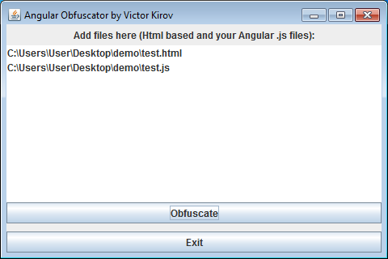

# AngularObfuscator
Java, Swing



**Original code:**
```
	var testApp = angular.module("myApp", []);
	testApp.controller("testController", function($scope) {
		$scope.myVar = 1;
		
		$scope.bumpUp = function() {
			$scope.myVar++;
		}
		
		$scope.bumpDown = function() {
			if ($scope.myVar>0) {
				$scope.myVar--;
			}
		}
		
	});
```

**Obfuscated code:**
```
var ZEZOQ = angular.module("myApp", []); ZEZOQ.controller("testController", function($scope) { $scope.UEGEYD = 1; $scope.NGB = function() { $scope.UEGEYD++; }; $scope.VUOYROE = function() { if ($scope.UEGEYD>0) { $scope.UEGEYD--; } } });
```

[Javadoc](doc/javadoc/index.html)
